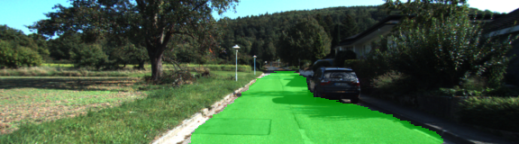

# Project: Semantic Segmentation

## 1. Overview
The purpose of the this project is to use the FCN-8s model
for labeling pixels of a road in images.
The FCN-8s model is a fully convolutional network based on the pre-trained layers of
the VGG16 model (with the fully connected layers replaced by the 1x1 convolutional layers).
For the detail of the FCN-8s model and its use for the semantic segmentation, please refer to
[the original paper](https://people.eecs.berkeley.edu/~jonlong/long_shelhamer_fcn.pdf)
and [this post](https://s3-us-west-1.amazonaws.com/udacity-selfdrivingcar/forum_archive/Semantic_Segmentation_advice.pdf).

## 2. Contents
A brief description of the contents of this repository is as follows:

- `main.py`: This Python file defines the FCN-8s model based on
the pre-trained VGG16 model and trains it with the training dataset.
(Note that currently the data augmentation implemented in `train_nn()` is turned off since it causes an error when running the unit test. Please turn off the unit test when using the data augmentation.)
- `helper.py`: This Python file defines some utility functions used in `main.py`.
- `projecy_test.py`: This Python file is used to check if the implementation of `main.py` is correct.
- `img_to_video.py`: This Python file is used to convert PNG images to a MP4 video file.
(When using this, please change appropriately the name of the directory in which the segmented images are stored.)
- `segmented_images`: This folder stores the test images with roads labeled in PNG format.
- `videos/segmentation.mp4`: MP4 file created by combining the PNG images in `segmented_images`.
- `videos/test.mp4`: A test MP4 video to apply the trained model for the semantic segmentation.  
- `videos/test_segmented.mp4`: MP4 file created by applying the trained model to `test.mp4`.   
- `README.md`: This markdown file itself.
- `images`: This folder contains images used in this `README.md`
- `images/loss.png`: PNG image plotting the number of epochs vs loss.
- `loss.txt`: This text file contains the loss for each epoch.
- `LICENSE`: Description of the License (MIT LICENSE).

For this project, [Kitti Road dataset](http://www.cvlibs.net/datasets/kitti/eval_road.php)
is used. The dataset can be downloaded from [here](http://www.cvlibs.net/download.php?file=data_road.zip).

The fully convolutional version of of the pre-trained VGG model used
for building the FCN-8s model can be downloaded from [here](https://s3-us-west-1.amazonaws.com/udacity-selfdrivingcar/vgg.zip).
Note that when running `main.py`, this pre-trained model is automatically downloaded.


## 3. Packages and Instruction

### 3.1. Packages
The following packages must be installed to run `main.py`:
- `Python 3`
- `tensorflow`
- `numpy`
- `scipy`
- `pillow`
- `scikit-image` (for data augmentation)
- `moviepy` (for applying the segmentation to mp4 video)
- `matplotlib` (for creating a plot of loss)

### 3.2. Instruction
To run the codes provided in this repository and
to carry out semantic segmentation of roads in images, follow the steps below:

1. Clone this repository and move there.

2. Create a new folder named `data`, download the training and test datasets from [here](https://s3-us-west-1.amazonaws.com/udacity-selfdrivingcar/advanced_deep_learning/data_road.zip),
unzip them and move to the folder `data`.

3. Under an environment with GPU available, run `main.py`:
```
python main.py
```
This will start the training of the neural network model defined in `main.py` file.
The images with detected roads colored in green are saved in the folder `runs`.
The test video with detected roads in green is saved as `videos/test_segmented.mp4`.
Note that the pre-trained VGG16 (fully convolutional version) is automatically
downloaded by running `main.py`. The loss (cross entropy loss plus L2 regularization loss)
for each epoch is stored in `loss.txt` and its plot is saved as `loss.png`.

4. In `img_to_video.py`, change the path to the folder with the images after
segmentation and run this Python file:
```
python img_to_video.py
```
This creates an MP4 file `segmentation.mp4` from the test images after the segmentation.

## 4. Implementation
In this project, I trained the FCN-8s model for semantic segmentation.
The followings are some key points of the implementation (for the detail,
please refer to `layers()` in `main.py`,
[the original paper on FCN-8s]((https://people.eecs.berkeley.edu/~jonlong/long_shelhamer_fcn.pdf))
and [this post](https://s3-us-west-1.amazonaws.com/udacity-selfdrivingcar/forum_archive/Semantic_Segmentation_advice.pdf)):

- For the encoder part, the fully convolutional version of the pre-trained VGG16 model is used.
- The decoder part is built by using some skip connections with the encoder part as follows:
  1. The 1x1 convolution is applied to the output of the 7th convolutional layer of the VGG16 model.
  2. 2 x upsampling is then applied to the output of Step (i) by using the de-convolutional layer.
  3. To the output of the 4th pooling layer of the VGG16 model, the scaling is applied
  (with the scaling factor `0.01`) and then the scaled result is injected to the 1x1 convolutional layer.
  4. The output of Step (ii) and that of Step (iii) are fused
  (i.e. simply sum the values of the two outputs at each cell).
  5. 2 x upsampling is then applied to the result of Step (iv) by using the de-convolutional layer.
  6. To the output of the 3rd pooling layer of the VGG16 model, the scaling is applied
  (with the scaling factor `0.0001`) and then the scaled result is injected to the 1x1 convolutional layer.
  7. The output of Step (v) and that of Step (vi) are fused.
  8. Finally, 8 x upsampling is applied to the output of Step (vii) by using the de-convolutional layer.  
- For all the convolutional and de-convolutional layers for upsampling, the weights are
initialized with the truncated normal (mean = 0, standard deviation = `0.001`)
and the L2 regularizer (scale = `0.001`) is used.  
- For the dropout layer in the VGG16 model, the probability to keep the units is set to `0.5`.
- For the loss, the cross entropy loss combined with L2 regularization loss is used. For optimization,
the Adam optimizer with the learning rate `0.00007` is used.
- For the training, the batch size is set to `8` and the number of
the epochs for the training is `40`. With `p2.xlarge` instance of AWS,
it takes about 1 minutes per epoch for training.
- The data augmentation is applied to training image by rescaling the intensity (= change contrast)
 and applying the gamma correction (please refer to `data_aug()` in `main.py` for the detail).

- As utility functions, I have implemented `save_inference_video()` which applies
the trained model to a video (by default, the input video name must be `test.mp4`)
and generates a video with segmentation for roads. Another utility function
`plot_loss()` is used to create a PNG file plotting the number of epochs vs loss.


## 5. Performance

To see the performance of the trained model, the number of epochs vs the loss
is plotted in the figure below. This shows that, on average,
the loss tends to decrease as the number of the epochs increases.

<!--  -->


Once the training is done, the trained model is used to carry out the segmentation
for the test images. The full result is stored in [`segmented_images`](segmented_images) folder
(and is combined to a mp4 video [`segmentation.mp4`](videos/segmentation.mp4)).
Examples of the images after the segmentation are shown below.

The following 4 images are good examples:
<!--  -->





The following 2 images are poor examples:


The segmented images in [`segmented_image`](segmented_images) show that the roads in most of the
test images are labeled correctly. In some best examples such as the first four images
above, more than 80% of the road pixels are labeled correctly and
less than 20% of the non-road pixels are labeled incorrectly.

As an option, I also applied the trained model to a video [`test.mp4`](videos/test.mp4).
The result [`test_segmented.mp4`](videos/test_segmented.mp4) shows that the trained model works decently for labeling the road.

Judging from the images with poor segmentation, still labeling by trained model
can fail when the road in the image is very dark or
when something with light color/similar color to a road exits near the true road.
More detailed data augmentation (further tuning of the contrast etc.) would help
to improve the performance.
